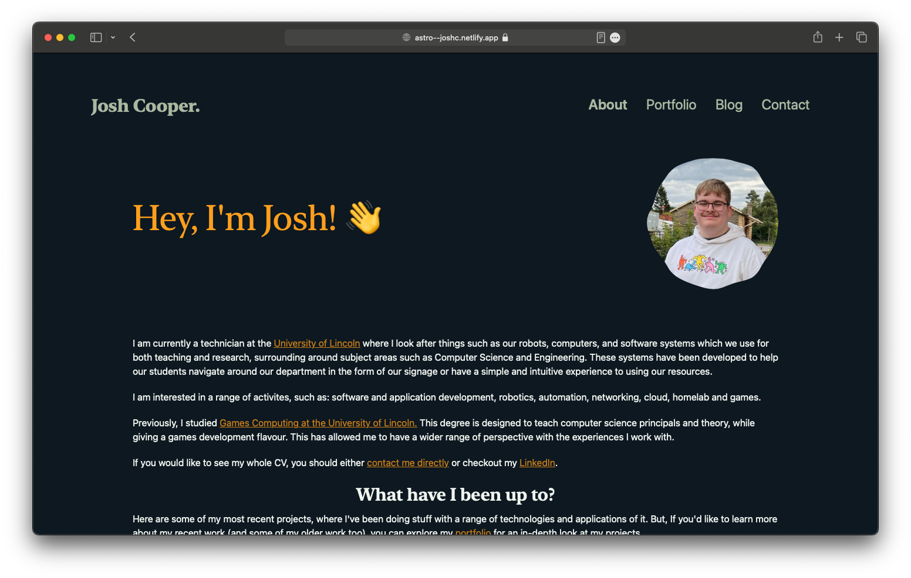

# joshc.uk

The personal site, portfolio and blog of Josh Cooper!

[](https://codespaces.new/cooperj/joshc.uk)



## Colour Palette


[Generated with coolors.co](https://coolors.co/0d1821-61988e-2a4d14-f0f4ef-ff9f1c)

## 🚀 Project Structure

This project is built using Astro. You'll see the following folders and files:

```text
├── .devcontainer/
|   └── devcontainer.json     # <--- This enables cool stuff like devcontainers and codespaces
├── public/
|   ├── .well-known/
|   ├── demos/
|   ├── favicons/
|   ├── files/
|   └── images/
├── src/
│   ├── components/
│   ├── content/
│   ├── layouts/
│   ├── pages/
│   └── styles/
├── astro.config.mjs
├── README.md
├── package.json
└── tsconfig.json
```

Astro looks for `.astro`, `.md`, `.mdx` files in the `src/pages/` directory. Each page is exposed as a route based on its file name.

## 🧞 Commands

All commands are run from the root of the project, from a terminal:

| Command                   | Action                                                |
| :------------------------ | :---------------------------------------------------- |
| `npm install`             | Installs dependencies                                 |
| `npm run dev`             | Starts local dev server at `localhost:4321`           |
| `npm run build`           | Build your production site to `./dist/`               |
| `npm run preview`         | Preview your build locally, before deploying          |
| `npm run astro ...`       | Run CLI commands like `astro add`, `astro check`      |
| `npm run astro -- --help` | Get help using the Astro CLI                          |
| `npm run lint`            | Calls prettier and lints all the files in the project |
