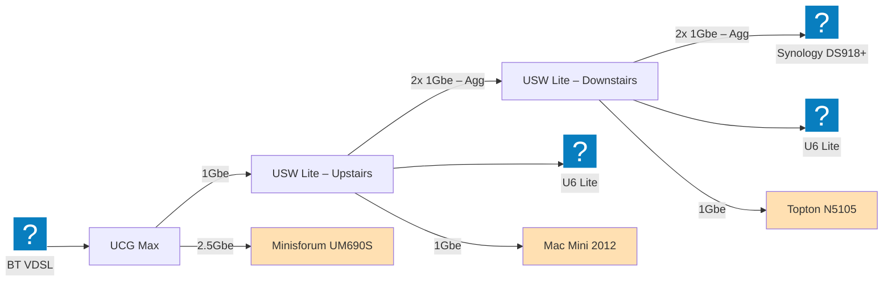

I have been running a homelab for years....

## 1. Hardware

### UniFi All the Things

This year I have finally replaced my old [Edgerouter-X](https://techspecs.ui.com/uisp/wired/er-x?ref=joshc.uk) with a new [UCG Max](https://uk.store.ui.com/uk/en/category/cloud-gateways-compact/collections/cloud-gateway-max?ref=joshc.uk) from UniFi. I quite like it – it just works. The real reason why I swapped it was move away from using a Docker based UniFi network only controller, and move to a fully managed system, with the added benefit of having a single dashboard and mobile app to manage it.

I added this to my existing setup with [2x U6 Lite APs](https://uk.store.ui.com/uk/en/category/all-wifi/products/u6-lite?ref=joshc.uk) and [2x USW Lite PoE Switches](https://uk.store.ui.com/uk/en/category/switching-utility/products/usw-lite-16-poe?ref=joshc.uk). 

I have a switch and AP on each floor of my house, with the switches connected to each other with 2 ports aggregated together, I did this for both redundancy and more bandwidth. I did this before 2.5GBE became an easy to obtain thing, if I were to replace the switches, I would swap for something that supported at least 2.5GBE.

And one feature that has become quite useful as a side effect of swapping to the new controller is the ability to configure ACLs on the Switches.

### Synology NAS
- DS918+ 
- 3x 4TB w/ BTRFS (SHR)

### Proxmox Cluster

#### Minisforum UM690S
- AMD Ryzen 9 6900HX
- 32GB DDR5 4800 MT/s 
- 1TB NVMe

#### Topton N5105

- Intel Celeron N5105
- 16 GB DDR4
- 1TB SATA

#### Mac Mini (2012)

- Intel Core i5-3210M
- 10GB DDR3 (2GB Original + 8GB eBay)
- 250GB SATA SSD

### Raspberry Pi 2

Also outside of the cluster, I have an old Raspberry Pi 2, this is the first Pi I brought, and has been chugging along ever since February 2015. I originally brought this to run Home Assistant, which wasn't as good as it is now – more about that later, but I am currently using Apple Home.

So this Pi is just acting as a [Homebridge](https://homebridge.io/) server, to connect non-HomeKit devices into Apple Home. Originally I ran more through it, but now it runs the [`homebridge-tplink-smarthome`](https://github.com/plasticrake/homebridge-tplink-smarthome) and [`homebridge-temperature-sensor-dht`](https://github.com/RaresAil/homebridge-temperature-sensor-dht) plugins.

The main purpose is to run the bridge for TP-Link HS100 smart plugs that I have brought about five over the years (but do not go out you're way to buy them now! Go buy something Matter or Zigbee supported, as they decided to try and close up the local API. Vote with your wallet, but don't replace what doesn't need replacing) and now need a way to keep them working.

The other thing is that it hosts a DHT22 sensor, but I plan on replacing this with it built on top of ESPHome or something out of the box Matter supported.

## 2. Apps and Services

So over the years, I've ran stuff and it's "fell over" and I've not been the best at keeping it alive, it's a *lab* after all!

Home automation
- Home assistant
- Homebridge
- Scrypted

Lots of stuff fell over

Generic Tools
- Traefik Proxy
- Change Detection
- Uptime Kuma
- Mail Proxy

## 3. Problems and Plans

So I have recently started running Home Assistant again, and since I first used it, it has grown to be an incredibly strong choice, and because of that I want to consolidate my tools. 

Currently I am running: Home Assistant, Homebridge and Scrypted, and all of automations are over the place. 

- No GPU access from Proxmox esp. on Minisforum box
- Macmini only used for quorum
- ipv6